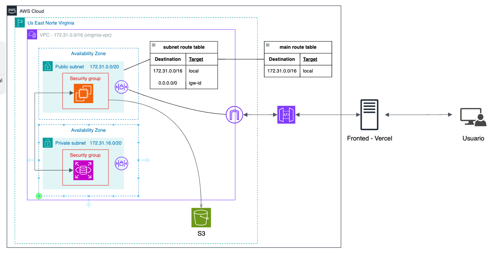

# 🧪 Prueba Técnica Full Stack – AWS (Alternativa en Azure/Cloudflare)

Este proyecto es el resultado de una prueba técnica enfocada en el desarrollo **Full Stack**, incluyendo diseño de base de datos, construcción de API con NestJS, y frontend con Next.js, integrando autenticación y protección de rutas. Aunque el reto planteaba AWS como infraestructura principal, debido a limitaciones en la free tier se uso como alternativa servicios como Azure App Service y Cloudflare R2. De igual forma se adjunta un esquema la solución en AWS.



## 🌎 Url del proyecto
[Sistema de Inventario](https://sistema-inventario-ptc.vercel.app/)
- https://sistema-inventario-ptc.vercel.app/
---

## 📐 Arquitectura y Tecnologías

- **Backend**: Node.js, NestJS, Prisma, JWT
- **Frontend**: React.js, Next.js
- **Base de Datos**: PostgreSQL (Neon Console)
- **Infraestructura**: Azure App Service (en lugar de EC2), Cloudflare R2 (en lugar de S3)

---

## 🔐 Funcionalidades Implementadas

### 🗃️ Base de Datos Relacional

- Diseño normalizado con relaciones 1:N entre Categoría y Producto
- Tipos de datos adecuados y buenas prácticas de modelado

### 📦 Back End

- 🔑 Autenticación con JWT (login seguro)
- ✅ CRUD completo para Productos y Categorías
- 📃 Paginación en el listado de productos
- 🔒 Rutas protegidas con token JWT
- ⚠️ Validaciones robustas y manejo de errores personalizados
- ❌ Prevención de duplicados por nombre

### 💻 Front End

- 📋 Formularios para creación, edición y eliminación de Productos y Categorías
- 📄 Grilla con paginación para listar productos
- 🔍 Validaciones en formularios (longitud, campos requeridos, tipos)
- 🔗 Consumo de APIs protegidas con JWT

### ✨ Extras

- 🌐 Mejora visual del diseño y experiencia de usuario
- 🧼 Código modular y limpio, fácil de escalar

---

## ☁️ Notas sobre Infraestructura

| Requisito AWS | Estado | Alternativa Implementada |
|---------------|--------|---------------------------|
| EC2           | ⚠️     | App Service de Azure      |
| S3            | ⚠️     | Cloudflare R2             |
| RDS           | ⚠️     | Neon Console              |
| SES           | ❌     | No implementado           |

---

## 🗄️ Modelo de Base de Datos

### 🧑‍💼 Tabla: `User`

| Campo     | Tipo       | Restricciones                  |
|-----------|------------|--------------------------------|
| id        | Int        | PK, AutoIncrement              |
| name      | String     | Único, VARCHAR(255), Requerido |
| password  | String     | VARCHAR(255), Requerido        |
| createdAt | DateTime   | Default: now()                 |
| updatedAt | DateTime   | Auto-update                    |

---

### 🗂️ Tabla: `Category`

| Campo     | Tipo       | Restricciones                  |
|-----------|------------|--------------------------------|
| id        | Int        | PK, AutoIncrement              |
| name      | String     | Único, VARCHAR(255), Requerido |
| createdAt | DateTime   | Default: now()                 |
| updatedAt | DateTime   | Auto-update                    |

🔗 **Relación**:  
- Una categoría puede tener **muchos productos** (1:N)

---

### 📦 Tabla: `Product`

| Campo       | Tipo       | Restricciones                        |
|-------------|------------|--------------------------------------|
| id          | Int        | PK, AutoIncrement                    |
| name        | String     | VARCHAR(150), Requerido              |
| description | String     | TEXT, Opcional                       |
| price       | Int        | Requerido                            |
| imageUrl    | String     | TEXT, Opcional                       |
| categoryId  | Int        | FK → Category(id), Requerido         |
| createdAt   | DateTime   | Default: now()                       |
| updatedAt   | DateTime   | Auto-update                          |

🔗 **Relación**:  
- Cada producto **pertenece a una categoría**

---

## 🚀 Cómo Ejecutar el Proyecto

### Backend

1. Clona el repositorio:
   ```bash
   git clone https://github.com/pauldev-20/sistema-inventario-ptc.git
   cd sistema-inventario-ptc/backend       
    ```
2. Instala las dependencias:
   ```bash
   npm install
   ```
3. Configura las variables de entorno en un archivo `.env`:
   ```bash
   cp .env.example .env
   ```
4. Configura la base de datos con los siguientes pasos:
   ```bash
   npm run db:generate
   npm run db:migrate
   npm run db:seed
   ```
5. Inicia el servidor:
   ```bash
   npm run start:dev
   ```

### Frontend

1. Accede al directorio del frontend:
   ```bash
   cd ../frontend
   ```
2. Instala las dependencias:
   ```bash
   npm install
   ```
3. Configura las variables de entorno en un archivo `.env`:
   ```bash
    cp .env.example .env
    ``` 
4. Inicia el servidor:
   ```bash
   npm run dev
   ```